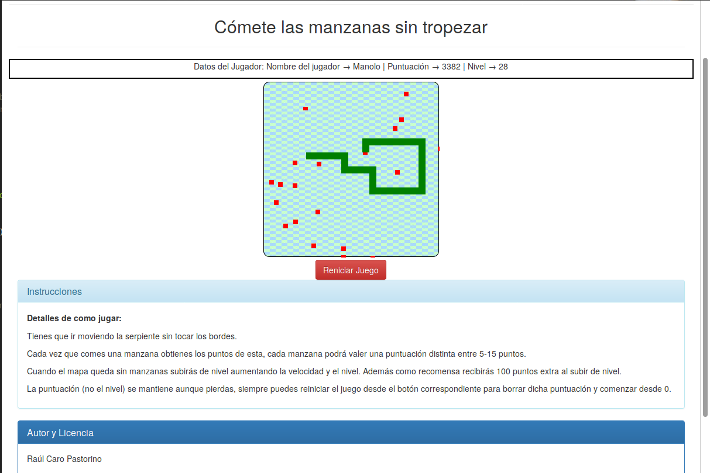

# Snake_Javascript
Game of Classic Snake writer in Javascript

El Clásico Juego de la serpiente que come manzanas mientras que a su vez la serpiente crece de tamaño, esta vez escrito en Javascript.

La realización de este juego es más para fines educativos que para lograr tener el juego en si 100% funcional y libre de fallos. Con esto quiero decir que lo realizo para practicar y a su vez lo dejo para que otros puedan reutilizarlo para el fin que prefieran (mientras se respete autoría y licencia libre GPLv3).

## Tecnologías
Todo el desarrollo del juego está escrito en Javascript Puro, sin usar ningún tipo de librería o framework. Aunque exista la librería jquery no es utilizada más allá de para lo que la use bootstrap.

Cada clase se divide en un archivo distinto conteniendo las siguientes:
- Manzana
- Mapa
- Player
- Score
- Serpiente

Las funciones puedes encontrarlas en el archivo **funciones.js** y el desarrollo del juego está disponible en **juego.js**

Ha sido redactado lo más documentado y legible posible, aún así reporta cualquier *sugerencia* o *error* que puedas notar.

## Objetivos o Instrucciones
El objetivo principal del juego es ir comiendo manzanas para acumular puntos (cada manzana puede valer entre 5 y 15 puntos) y subir de nivel, cada nivel traerá las siguientes características:
- Aumenta la velocidad de juego levemente
- Aumenta en 100 puntos de recompensa por subir de nivel
- Cada nivel tiene 1 manzana más que el anterior

## Licencia
Proyecto bajo [Licencia GPLv3](href="https://www.gnu.org/licenses/gpl-3.0-standalone.html) Adjunta en el [repositorio](https://github.com/fryntiz/Snake_Javascript/blob/master/LICENSE) también.

Licencia libre con reconocimiento de autoría y proyectos derivados bajo las mismas condiciones y licencia.

## Autor
Nombre  → Raúl Caro Pastorino

WEB     → http://www.fryntiz.es

Nick    → @fryntiz

Twitter → https://twitter.com/fryntiz

Email   → tecnico@fryntiz.es

GitHub  → https://github.com/fryntiz/
